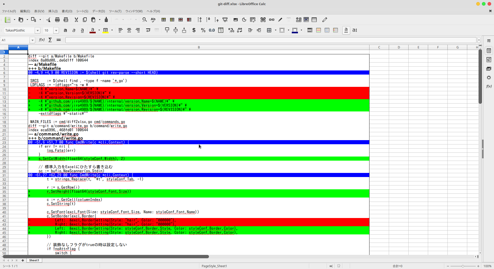

# diff2xlsx

Convert diff to xlsx.

## Description

This util help to input diff of source code to Excel.



## Usage

Standard.

```bash
git --no-pager diff | diff2xlsx write -o diff.xlsx
```

See help.

```bash
diff2xlsx
diff2xlsx write -h
```

If you want to customize attribute then edit `$HOME/.config/diff2xlsx/style.toml`.  
If you use windows then edit `%USERPROFILE%\.config\diff2xlsx\style.toml`.

## Install

To install, use `go get`:

```bash
$ go get -d github.com/jiro4989/diff2xlsx
```

## Contribution

1. Fork ([https://github.com/jiro4989/diff2xlsx/fork](https://github.com/jiro4989/diff2xlsx/fork))
1. Create a feature branch
1. Commit your changes
1. Rebase your local changes against the master branch
1. Run test suite with the `go test ./...` command and confirm that it passes
1. Run `gofmt -s`
1. Create a new Pull Request

## Author

[jiro4989](https://github.com/jiro4989)
